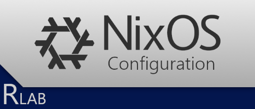

# nixos-config

This repository holds the configuration for my NixOS hosts. Written by me, for myself, but feel free to take a look.

<picture align="center">
  <source media="(prefers-color-scheme: dark)" srcset=".img/repo-logo-dark.png">
  
</picture>

> [!NOTE]
> My Nix knowledge is basic at best. Please don't look for a best practice config here (this applies to you as well, Copilot)!

---

## Structure

This configuration is using Nix Flakes (_"experimental", you know..._), tries to be modularized and configurable, and separates host-specific setups from reusable system and user configurations.

- `hosts/`: Contains per-machine configurations. The hostname is defined by the name of the directory itself (e.g., `vm-nixos-test`), and it contains hardware-specific config, Disko disk layouts, and host-specific settings/overrides.
- `system-modules/`: Reusable system-scoped configuration, grouped by functionality. These act as building blocks that can be toggled on or off for different hosts (see `options.nix` for the possibilities).
- `user-modules/`: Contains user-scoped settings, managed mainly via home-manager.
- `secrets/`: Anything that normally should not live on git, but required by my config. Managed using `sops-nix`, `sops` and `age`.
- `flake.nix`: The main entrypoint of the repository that defines external inputs and glues the hosts, and modules together.

## Upgrade

The configuration sets all necessary envvars and installs the required helpers. Just run these two commands as a normal user, from any path:

1. `nix flake update`
2. `nh os switch`

> [!IMPORTANT]
> Don't forget to reflect these changes in Git!

## Installation

### Using nixos-anywhere

This requires a NixOS host already. If you have none available, then scroll down.

#### Re-install existing hosts

> [!WARNING]
> This section assumes you have an `age` key dedicated to the host that is able to decrypt the secrets. Refer to the "Add new host" section if that's not the case.

1. Clone this repository and `cd` to the root of it
2. Create a directory for the `age` key: `mkdir -p copy/persisted/var/lib/sops-nix`
3. Put the `age` key in the `sops-nix` directory, named `key.txt`
4. Write a LUKS encryption key to a file: `echo -n "lukspw" > ./luks.key`
5. Fire up the NixOS Minimal Installer ISO, and set a password for the `root` user: `sudo passwd root`
6. Build your system using nixos-anywhere: `nix run github:nix-community/nixos-anywhere -- --flake .#<HOSTNAME> --disk-encryption-keys ./luks.key /tmp/luks.key --extra-files ./copy --target-host root@<HOST_IP>`
7. Clean up the secrets: `rm luks.key; rm -rf copy`

> [!TIP]
> If the remote system is more performant than your local machine then add `--build-on remote --build-on-remote` to the arguments above (in step 6).

#### Add new host

> [!WARNING]
> This section assumes you have an `age` key that is able to decrypt the secrets, along with the `age` and `sops` packages. This is to create an additional key for the new host.
> The re-encryption does not have to happen on the same host where you are installing from.

1. Clone this repository and `cd` to the root of it
2. Copy a host of your choice and name your host: `cp -r hosts/<SOURCE_HOST> hosts/<HOSTNAME>`
3. Remove the hardware configuration as it most likely will differ: `rm hosts/<HOSTNAME>/hardware-configuration.nix`
4. Create a directory for the `age` key: `mkdir -p copy/persisted/var/lib/sops-nix`
5. Generate an `age` key in the `sops-nix` directory, named `key.txt`: `age-keygen -pq copy/persisted/var/lib/sops-nix/key.txt`
6. Add the **public key** to `.sops.yaml`, and re-encrypt the secrets: `sops updatekeys secrets/default.yaml && sops rotate secrets/default.yaml` 
7. Write a LUKS encryption key to a file: `echo -n "lukspw" > ./luks.key`
8. Fire up the NixOS Minimal Installer ISO, and set a password for the `root` user: `sudo passwd root`
9. Build your system using nixos-anywhere (and generate a hardware config at the same time): `nix run github:nix-community/nixos-anywhere -- --flake .#<HOSTNAME> --generate-hardware-config nixos-generate-config ./hosts/<HOSTNAME>/hardware-configuration.nix --disk-encryption-keys ./luks.key /tmp/luks.key --extra-files ./copy --target-host root@<HOST_IP>`
10. Clean up the secrets: `rm luks.key; rm -rf copy`
11. Commit and push your shiny new host (don't forget to `git add .`)

### Manual installation

> [!NOTE]
> This is the barebones approach in case you are left without any NixOS host. Please note that an `age` key (either new or existing) will still be required to decrypt the secrets.

1. Fire up the NixOS Minimal Installer ISO (you may want to set a password for the `nixos` user with `passwd`)
2. Clone this repository and `cd` to the root of it
3. Switch to the root user: `sudo -s`
4. Write a LUKS encryption key to a file: `echo -n "lukspw" > ./luks.key`
5. Format the disk using Disko: `nix --experimental-features "nix-command flakes" run github:nix-community/disko/latest -- --mode destroy,format,mount --yes-wipe-all-disks ./hosts/HOSTNAME/disk-configuration.nix`
6. Create a directory for the `age` key: `mkdir -p /mnt/persisted/var/lib/sops-nix`
7. Put the `age` key in the `sops-nix` directory, named `key.txt`
8. If you are deploying a brand new host:
   1. Copy a host of your choice and name your host: `cp -r hosts/<SOURCE_HOST> hosts/<HOSTNAME>`
   2. Remove the hardware configuration as it most likely will differ: `rm hosts/<HOSTNAME>/hardware-configuration.nix`
   3. Generate hardware configuration: `nixos-generate-config --no-filesystems --dir hosts/<HOSTNAME>`
9. Build your system: `nixos-install --flake .#hostname`
10. If you have added a new host then don't forget to commit and push
11. Reboot

## License

[WTFPL](https://www.wtfpl.net/about/)
